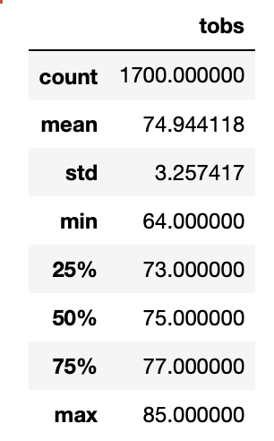
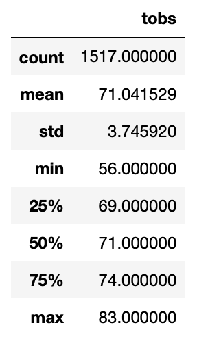
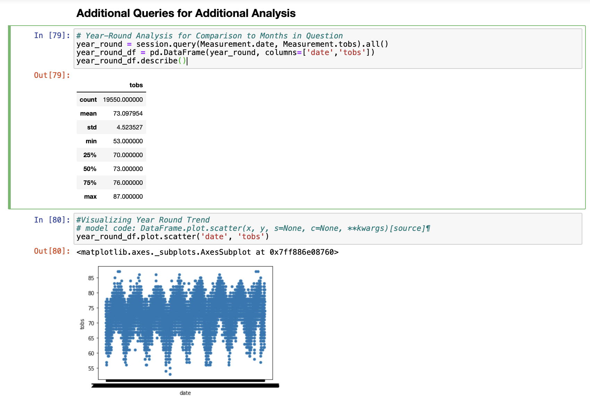

# surfs_up

## Overview of the Analysis
This quick analysis was intended to gather temperature data for the months of June and December in Oahu, Hawaii in order to determine if the surf and ice cream shop business is sustainable year-round, and, ultimately, to ameliorate concerns from a prospective investor. To conduct this analysis, I made use of the following tools: Python/jupyter notebook and SQLAlchemy.

## Results
For those interested in taking a look at the data for themselves, please see the tables below. For those interested in obtaining a handful of takeaways, here are three major takeaways from this analysis: 
* there is very little variance in temperature (approximately 3 degrees)in Oahu from the average 71 to 74 degrees it experiences, June and December respectively.
* Oahu does experience low temperatures (approximately 65), though rare, that could create a temporary dip in business.
* given the high number of observations for each month, we can act on this exploratory data analysis with confidence.

### _June Temperature Results_

### _December Temperature Results_

## Summary
At a high level, we can understand from this analysis that temperatures in Oahu in June and December are consistently favorable for enjoying ice cream and surfing thus supporting the business idea year-round. 

In addition to the that, we can also use the following additional queries to come to a similar conclusion. The first query performs a similar query to the above to establish the consistency of June and December temperatures with the rest of the year.The second query creates a scatter plot to illustrate the consistency of the results.

